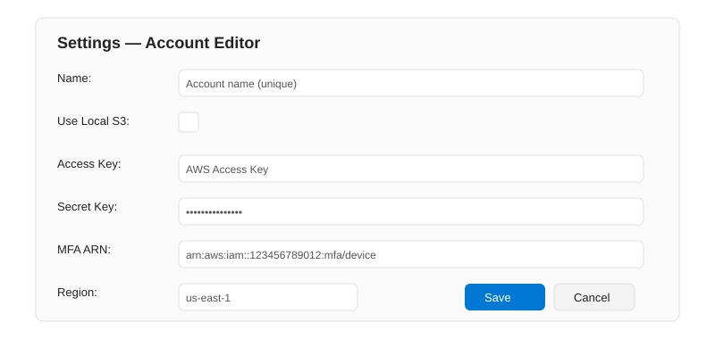
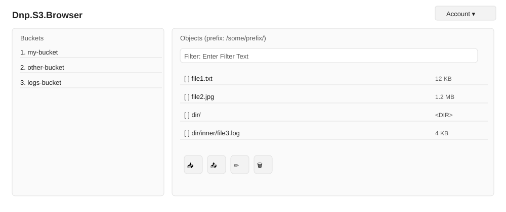

# Dnp.S3.Browser

A .NET MAUI (.NET 10) S3 browser UI for working with S3-compatible storage. The UI project is Dnp.S3.Browser.UI and supporting libraries provide services and viewmodels.

Highlights
- Supports AWS S3 and a LocalS3 filesystem-backed implementation (controlled with UseLocalS3 in appsettings).
- MFA support: when explicit AWS credentials (AWS:AccessKey and AWS:SecretKey) are provided and an MFA device ARN (AWS:MFA) is set, the app will prompt for an MFA code and exchange it for temporary session credentials using STS. On Windows a native dialog is used; on other platforms an inline popup is shown.
- Filtering: the Objects pane provides an overlaid filter prompt ("[Enter Filter Text]") — start typing to filter results in real time.
- Multi-select and batch operations: select multiple objects to download or delete several items at once.
- Multi-file upload: select multiple local files for upload into the selected bucket/prefix.

Configuration and settings

The application previously relied on Dnp.S3.Browser.UI/appsettings.json for runtime configuration. Settings have been migrated to a local SQLite store so multiple named accounts and secure storage of secrets are supported.

Key points
- Primary settings are now stored in a SQLite database at the app data folder (FileSystem.AppDataDirectory/settings.db).
- Secret values (SecretKey) are encrypted with AES-GCM when a platform SecureStorage implementation is available. The symmetric key is stored in SecureStorage under the key "settings_db_key".
- On first run (no default account found) the app displays a blocking settings editor over the main page to create the initial account.
- Multiple named accounts are supported. Use the Account menu on the main page to Add, Edit, Set default, or Delete accounts.
- appsettings.json is still shipped as a fallback for CI scenarios and when explicit values are desired, but runtime configuration prefers the SQLite-backed settings store.

For compatibility the following keys are still recognized as fallbacks from appsettings.json (only used when no SQLite value exists):
- UseLocalS3 (bool)
- AWS:AccessKey (string)
- AWS:SecretKey (string)
- AWS:MFA (string)
- AWS:Region (string)

Startup logging (diagnostics)
- To help diagnose startup UI issues enable gated startup logging by setting the environment variable DNP_S3_STARTUP_LOG=1 for the debug session. This will emit short traces to the debug output about the initial-settings prompt flow.

Security notes
- If the SecureStorage key is not available (platform/permission restrictions), SecretKey will be stored in plaintext in the DB so the app remains functional. Re-saving the account on a platform with SecureStorage available will encrypt the secret.
- Moving the DB to another device will not migrate the SecureStorage key — secrets encrypted on one device cannot be decrypted on another without migrating the SecureStorage key separately.

Features in detail
- Filtering
  - The Objects list includes a filter control with an overlaid prompt. The overlay hides when the control is focused or when the user types; filtering occurs as you type.

- Multi-object download
  - Select multiple files (CTRL/Shift-select or platform selection gestures) and use the Download action to retrieve many files at once. On Windows you can choose a target folder; on other platforms the app uses the app data Downloads folder.

- Multi-object delete
  - Select multiple items and confirm deletion.

- Multi-file upload
  - Use the Upload action to select and upload many local files in a single operation.

Settings & Account management UX
- First-run: when the app starts with no default account, a modal overlay (inline on the main page) will prompt the user to create the initial account. The app blocks until a default account is created.
- Account menu: the main page includes an Account menu (top-right). Click it to add a new account or manage existing ones (Edit, Set as default, Delete).

Mockups

Settings editor (first-run / add / edit)

Main page (buckets and objects)

Notes about the mockups
- The settings editor uses the app's theme resources (PrimaryTextColor, InputBackgroundColor, BorderColor, etc.) so colors and contrast match the main UI.
- The UI overlay frames input fields so text is visible even when the underlying overlay is semi-transparent.

If you prefer different styling or want PNG screenshots, run the app and I can embed actual screenshots into the README instead of the SVG mockups.

Building & running
- Prerequisites: .NET 10 SDK, MAUI workloads installed. Visual Studio 2026 with MAUI support recommended.
- Open the solution in Visual Studio and run the Dnp.S3.Browser.UI project.
